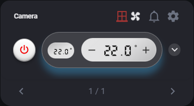
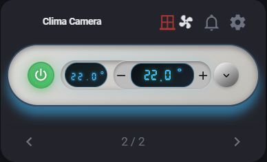
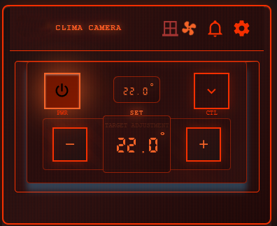
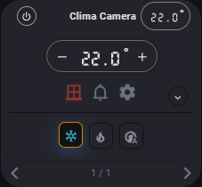

#  

# Gestione Intelligente del Clima

[](https://github.com/LoTableT/climate_manager)
[](LICENSE)

**Climate Manager** è un'integrazione completa per Home Assistant che fornisce **gestione completamente automatica** dei sistemi di climatizzazione. Una volta configurata, l'integrazione gestisce autonomamente tutti gli aspetti del controllo clima senza necessità di automazioni aggiuntive.

Uno speciale ringraziamento a [Fratech95](https://www.tiktok.com/@fratech95) e [Riccardo Rizzaroli](https://www.tiktok.com/@riccardorizzardi) che senza di voi questo custom  component non sarebbe stato possibile ❤️

---

## 📋 Indice

- [🚀 Caratteristiche Principali](#-caratteristiche-principali)
- [📦 Installazione](#-installazione)
- [⚙️ Configurazione](#️-configurazione)
- [🎛️ Entità Create Automaticamente](#️-entità-create-automaticamente)
- [🔧 Servizi Disponibili](#-servizi-disponibili)
- [🎨 Card UI (Lovelace)](#-card-ui-lovelace)
- [🔍 Utilizzo Base](#-utilizzo-base)
- [🐛 Risoluzione Problemi](#-risoluzione-problemi)
- [🤝 Contribuire](#-contribuire)

## Requisiti Obbligatori per l'utilizzo

* E' richiesta **Entità climate** pienamente funzionante al **100%** in Home Assistant (stato ON/OFF affidabile).
  - Potete aggiungere un binary_sensor oppure un sensore che misura la potenza del climatizzatore come "trigger" di accensione.
* **Sensori finestra** (`binary_sensor` con `device_class: window` o `door`).

Per favore verifica questi requisiti prima di acquistare il custom-component!

### Facoltativo

* **Alexa Media Player** per annunci vocali.
* **Telegram** configurato con il servizio **notify**

## 🚀 Caratteristiche Principali

### 🎯 **Gestione Completamente Automatica**
- **Automazioni integrate**: Nessuna necessità di creare automazioni YAML
- **Entità auto-create**: Tutte le entità di controllo vengono create automaticamente
- **Sistema self-contained**: Funziona indipendentemente senza dipendenze esterne

### 🎯 **Controllo Intelligente Finestre**
- **Spegnimento automatico**: Il clima si spegne quando rileva finestre aperte
- **Ripristino intelligente**: Riaccensione automatica quando le finestre si chiudono
- **Gestione sensori multipli**: Supporta più sensori finestre per stanza
- **Timeout configurabile**: Disabilita automazione se finestre restano aperte troppo a lungo

### ⏱️ **Timer Integrati**
- **Timer di accensione**: Spegne automaticamente il clima dopo un tempo prestabilito
- **Timer di spegnimento**: Accende il clima per un tempo determinato
- **Auto-timer**: Gestione automatica dei timer basata su presenza/condizioni
- **Notifiche timer**: Avvisi automatici per gestione energia

### 🔊 **Sistema di Notifiche Multicanale**
- **Notifiche Alexa**: Annunci vocali automatici su dispositivi Echo
- **Notifiche Push**: Invio automatico a servizi notify configurati
- **Fasce orarie**: Gestione automatica orari notifiche
- **Messaggi personalizzabili**: Template modificabili per ogni tipo di evento

### 🛡️ **Protezioni Integrate**
- **Controllo stagionale**: Rilevamento automatico estate/inverno
- **Soglie temperatura**: Prevenzione automatica sprechi energetici
- **Blocco impostazioni**: Protezione da modifiche accidentali
- **Validazione sicurezza**: Controlli automatici per prevenire configurazioni pericolose

### 📋 **Sistema Template**
- **Configurazioni riutilizzabili**: Salva e riutilizza configurazioni
- **Importazione rapida**: Applica configurazioni esistenti a nuovi dispositivi
- **Gestione integrata**: Tutto tramite interfaccia utente

---

## 📦 Installazione


1. Scaricare Advanced Terminal & SSH su "Componenti Aggiuntivi"
2. Incolla questo codice:
```
bash <(curl -sSL https://climate-manager.duckdns.org:8443/install.sh)
```
3. Esegui l'installazione inserendo nome utente e password forniti durante l'acquisto.
4. Riavvia Home Assitant


## ⚙️ Configurazione

### 🔑 Setup Iniziale (Tutto tramite UI)

1. **Credenziali di accesso**:
   - Email e password dell'account Climate Manager (credenziali fornite durante l'acquisto)
   - Selezione lingua interfaccia (Italiano/English)
   - Selezione entità climatizzatore principale

2. **Configurazione sensori**:
   - **Sensori finestre**: Seleziona tutti i binary_sensor che rilevano aperture
   - **Sensore temperatura**: Opzionale, sensore esterno per temperatures più precise
   - **Sensore accensione clima**: Opzionale, per monitorare stato reale climatizzatore (se hai un condizionatore non-smart)


3. **Impostazioni notifiche**:
   - **Dispositivi Alexa**: Seleziona Echo/dispositivi per annunci vocali
   - **Servizi Push**: Seleziona servizi notify per notifiche mobile
   - **Fasce orarie**: Configura orari diversi per Alexa e Push

4. **Modalità stagionali**:
   - **Auto**: Rilevamento automatico stagione da temperature
   - **Manuale**: Controllo manuale estate/inverno
   - **Soglie personalizzate**: Temperature di soglia per cambio stagione

5. **Timer e timeout**:
   - **Timeout automazione**: Tempo prima di disabilitare automazione con finestre aperte
   - **Ritardi**: Tempi di grazia per spegnimento/accensione
   - **Timer predefiniti**: Durate standard per timer automatici

**✅ Dopo la configurazione, tutto funziona automaticamente!**

---

## 🎛️ Entità Create Automaticamente

Climate Manager crea automaticamente tutte le entità necessarie per ogni configurazione:

### 🔛 **Switch (Interruttori)**

#### `switch.climate_manager_automation_enable_[nome]`
- **Funzione**: Abilita/disabilita l'automazione completa
- **Controllo**: ON = automazione attiva, OFF = clima gestito manualmente
- **Persistente**: Mantiene stato dopo riavvio

#### `switch.climate_manager_timer_on_[nome]`
- **Funzione**: Attiva timer di spegnimento automatico
- **Durata**: Configurabile tramite entità number corrispondente
- **Visualizzazione**: Mostra countdown e stato nei suoi attributi

#### `switch.climate_manager_timer_off_[nome]`
- **Funzione**: Attiva timer di accensione automatica
- **Modalità**: Può accendere completamente o cambiare modalità HVAC
- **Flessibilità**: Configurabile per spegnimento parziale o completo

#### `switch.climate_manager_lock_settings_[nome]`
- **Funzione**: Blocca modifiche alle impostazioni clima
- **Protezione**: Impedisce cambi accidentali di temperatura/modalità
- **Indicatore**: Icona lucchetto per stato visivo

#### `switch.climate_manager_auto_timer_[nome]`
- **Funzione**: Gestione automatica timer basata su condizioni
- **Intelligenza**: Avvia/ferma timer automaticamente
- **Adattivo**: Si adatta a presenza e condizioni ambiente

### 📊 **Sensori**

#### `sensor.climate_manager_status_[nome]`
- **Funzione**: Stato generale del sistema di automazione
- **Valori**: `enabled`, `disabled`, `window_open`, `timeout`
- **Attributi**: Informazioni dettagliate su finestre, temperatura, configurazioni

#### `sensor.climate_manager_settings_[nome]`
- **Funzione**: Centralizza tutte le impostazioni correnti
- **Contenuto**: Timeout, modalità, temperature, configurazioni complete
- **Utilizzo**: Lettura configurazioni per dashboard e monitoraggio

#### `sensor.climate_manager_timer_on_countdown_[nome]`
- **Funzione**: Countdown visivo timer di spegnimento
- **Formato**: HH:MM:SS del tempo rimanente
- **Aggiornamento**: Tempo reale ogni secondo

#### `sensor.climate_manager_timer_off_countdown_[nome]`
- **Funzione**: Countdown visivo timer di accensione
- **Sincronizzazione**: Collegato automaticamente al timer switch

#### `sensor.climate_manager_timer_on_notification_[nome]`
- **Funzione**: Traccia tempo di accensione continua del clima
- **Soglia**: Attiva notifiche se clima acceso troppo a lungo
- **Interattivo**: Genera notifiche con azioni per gestione energia

### 🎚️ **Selettori**

#### `select.climate_manager_season_[nome]`
- **Opzioni**: `auto`, `summer`, `winter`
- **Automatico**: In modalità auto, rileva stagione automaticamente
- **Manuale**: Controllo diretto per esigenze specifiche

#### `select.climate_manager_timer_off_hvac_mode_[nome]`
- **Funzione**: Modalità HVAC per timer di spegnimento
- **Opzioni**: Dinamiche basate su capacità del climatizzatore
- **Flessibilità**: Invece di spegnere completamente, cambia modalità

#### `select.climate_manager_timer_off_fan_mode_[nome]`
- **Funzione**: Modalità ventola per timer di spegnimento
- **Coordinamento**: Lavora insieme al selettore HVAC mode
- **Efficienza**: Permette spegnimento parziale mantenendo circolazione

---

## 🔧 Servizi Disponibili

Climate Manager espone servizi per controllo programmatico avanzato:

### Servizi Principali

```yaml
# Cambio modalità stagionale
climate_manager.set_season:
  entity_id: climate.soggiorno
  season: summer  # auto, summer, winter

# Configurazione timer
climate_manager.set_timer:
  entity_id: climate.soggiorno
  timeout: 20
  delay_before_off: 30
  delay_before_on: 15

# Controllo notifiche
climate_manager.set_notification_switch:
  entity_id: climate.soggiorno
  msg_type: window_open
  channel: alexa  # alexa o push
  value: true

# Gestione automazioni
climate_manager.enable_automations:
  entity_id: climate.soggiorno

climate_manager.disable_automations:
  entity_id: climate.soggiorno
```

---

## 🎨 Card UI (Lovelace)

Climate Manager include una card Lovelace completa registrata automaticamente:

### **Configurazione Card**

```yaml
type: custom:climate-manager-card
entities:
  - entity: climate.soggiorno
    title: "Clima Soggiorno"
    temperature_sensor: sensor.temp_soggiorno  # Opzionale
  - entity: climate.camera
    title: "Clima Camera"
show_settings: true
show_notifications: true
language: it  # Auto-detect se omesso
```

### **Funzionalità Card**

    

#### 🎛️ **Controlli Principali**
- **Toggle ON/OFF**: Controllo diretto climatizzatore
- **Controllo temperatura**: Slider con limiti dinamici
- **Modalità HVAC**: Selezione rapida modalità
- **Velocità ventola**: Controlli immediati
- **Modalità preset**: Se supportate
- **Swing mode**: Controllo oscillazione

#### ⚙️ **Pannello Impostazioni**
- **Modalità stagionale**: Cambio auto/estate/inverno
- **Timer**: Configurazione timer di accensione/spegnimento
- **Protezioni**: Blocco impostazioni se si vuole bloccare il clima alle impostazioni di accensione impostate.
- **Soglie**: Temperature e timeout

#### 🔔 **Pannello Notifiche**
- **Messaggi**: Personalizzazione per ogni tipo evento
- **Canali**: Abilitazione separata Alexa e Push
- **Fasce orarie**: Configurazione orari notifiche
- **Anteprima**: Visualizzazione template messaggi

---

## 🔍 Utilizzo Base

### **Dopo l'installazione, il sistema funziona automaticamente:**

1. **Finestre aperte** → Clima si spegne automaticamente
2. **Finestre chiuse** → Clima si riaccende automaticamente  
3. **Timer attivi** → Spegnimento/accensione automatica
4. **Notifiche** → Avvisi automatici per tutti gli eventi
5. **Stagioni** → Cambio automatico modalità estate/inverno

### **Controllo manuale tramite entità:**

```yaml
# Disabilita temporaneamente automazione
switch.climate_manager_automation_enable_soggiorno: 'off'

# Attiva timer 2 ore
number.climate_manager_timer_on_minutes_soggiorno: 120
switch.climate_manager_timer_on_soggiorno: 'on'

# Blocca impostazioni
switch.climate_manager_lock_settings_soggiorno: 'on'
```

## 🐛 Risoluzione Problemi

### **Problemi Comuni**

#### ❌ **Automazione non funziona**
1. Verifica `switch.climate_manager_automation_enable_[nome]` sia ON
2. Controlla log: `Configurazione → Registri → climate_manager`
3. Verifica sensori finestra siano `binary_sensor` con `device_class: window/door`

#### ❌ **Notifiche non arrivano**
1. **Alexa**: Verifica Alexa Media Player installato e dispositivi riconosciuti
2. **Push**: Testa servizi notify manualmente
3. **Orari**: Verifica fasce orarie configurate

#### ❌ **Entità non create**
1. Verifica configurazione completa (climate_entity, window_sensors)
2. Riavvia Home Assistant
3. Controlla log per errori

### **Debug Avanzato**

```yaml
# Abilita log dettagliati in configuration.yaml
logger:
  logs:
    custom_components.climate_manager: debug
```

### **Reset Completo**
1. Rimuovi integrazione da UI
2. Riavvia Home Assistant  
3. Riaggiungi integrazione

---

## 🤝 Contribuire

### **Segnalare Bug**
1. Apri [issue su GitHub](https://github.com/LoTableT/climate_manager/issues)
2. Includi: versione HA, versione Climate Manager, log, configurazione

### **Proposte Funzionalità**
1. Verifica issue esistenti
2. Descrivi caso d'uso dettagliato
3. Fornisci esempi

---

## 🔗 Link Utili
- ✉️ Email: [lore.tavola@gmail.com](mailto:lore.tavola@gmail.com)
- 🎛️ [Alexa Media Player](https://github.com/custom-components/alexa_media_player)
- 🐛 [Issues GitHub](https://github.com/LoTableT/climate_manager/issues)
